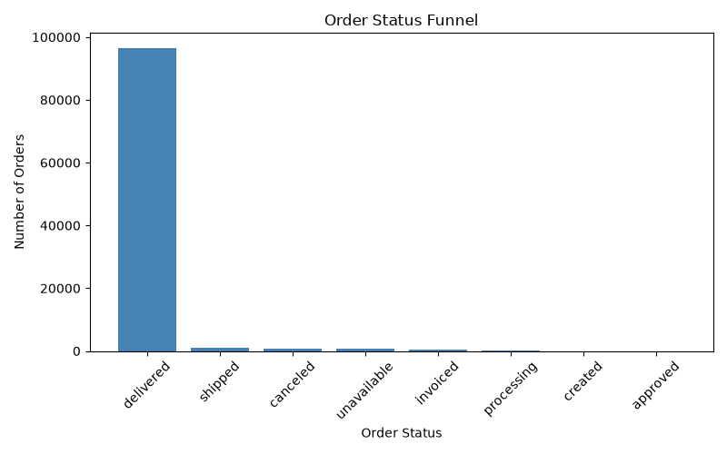
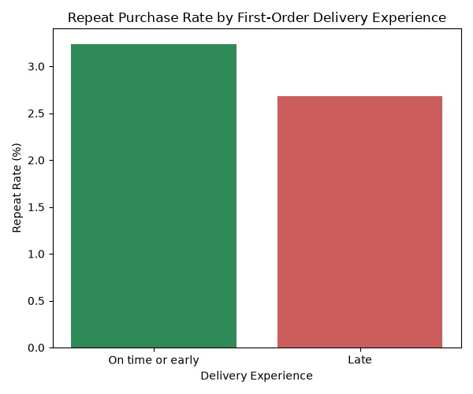
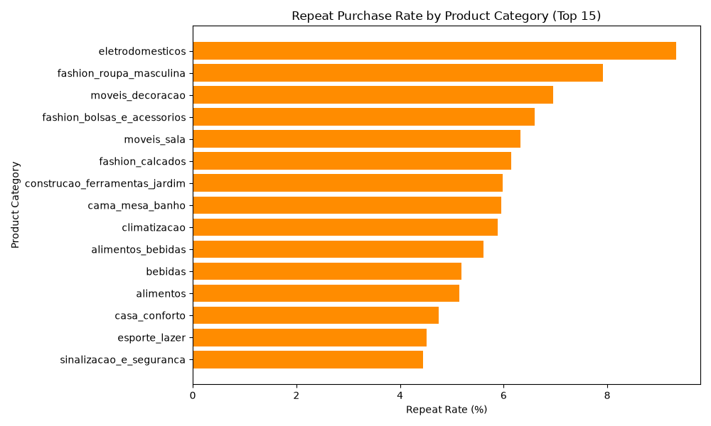

# Olist E-Commerce: Customer Funnel & Retention Analysis

## Problem
Olist, a Brazilian e-commerce marketplace, wanted to understand where customers drop off in their purchase journey and why so few customers return for a second order. This analysis uses SQL and Python to map the order funnel, quantify overall repeat-purchase behavior, and identify two potential levers — delivery experience and product category — that correlate with retention.

## Method
Analyzed 99,441 orders and 96,096 unique customers from the [Olist Brazilian E-Commerce public dataset](https://www.kaggle.com/datasets/olistbr/brazilian-ecommerce) (2016–2018) using MySQL for querying and Python (pandas, matplotlib) for visualization. Built a funnel by order status, calculated true repeat-purchase rate using `customer_unique_id` (since `customer_id` is order-level, not customer-level), and isolated each customer's first order using window functions (`ROW_NUMBER()`) to avoid double-counting customers with mixed delivery experiences.

## Key Findings

**1. 97% of orders reach "delivered"** — the operational funnel is healthy; drop-off isn't the core issue.

**2. Only 3.12% of customers ever place a second order** (2,997 of 96,096) — indicating a retention problem, not an acquisition or fulfillment one.

**3. On-time first delivery correlates with a ~21% higher repeat rate** (3.24% vs. 2.68% for late deliveries).

**4. Repeat rate varies ~2x across product categories** (4.4%–9.3%), with home appliances and fashion outperforming commodity categories like sports/leisure.

## Recommendation
Prioritize delivery-reliability improvements (e.g., more conservative estimated delivery dates, proactive delay notifications) as a near-term retention lever, since it's measurable and within operational control. Pair this with targeted retention campaigns in high-repeat categories rather than spreading retention spend evenly.

## Limitations
- Category analysis reflects each customer's first purchase category only; a second purchase may be in a different category.
- "On-time" is judged against Olist's own estimated delivery date, not a fixed SLA.
- No customer feedback/review data was incorporated to validate *why* delivery timing affects retention.

## Tools
MySQL, Python (pandas, matplotlib)
